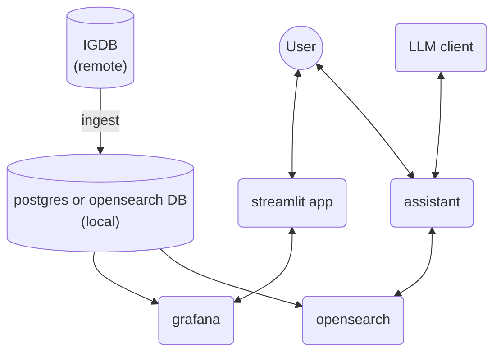

[](https://github.com/sponsors/pedro-cardoso16)
[](https://www.buymeacoffee.com/pedro.cardoso)
# Video game assistant

Get fast reviews of video games using an extensive aggregated source of metadata and reviews.


## Getting started

In this folder execute
```bash
docker compose up
```


## Architecture



RAG
Search evaluation (MRR, RRF)
Response with RAG evaluation (LLM as a judge)
Tool usage evaluation (LLM as a judge)

### Data ingestion from IGDB
We use [IGDB](https://www.igdb.com/) information for ingesting metadata and reviews. The data is available remotely and is ingested into the local store (Postgres or OpenSearch) for retrieval.

### Architecture assessment
- Strengths: clear separation of responsibilities (ingest, retrieval, LLM, UI), use of OpenSearch for RAG enables fast vector/keyword search, and Grafana for observability.
- Risks/Improvements: consider explicit vector store and embedding service, caching of LLM responses, access control for remote IGDB, and automated ETL for data freshness. Also clarify whether Postgres or OpenSearch is the primary source of truth and ensure schema/versioning for ingested data.
