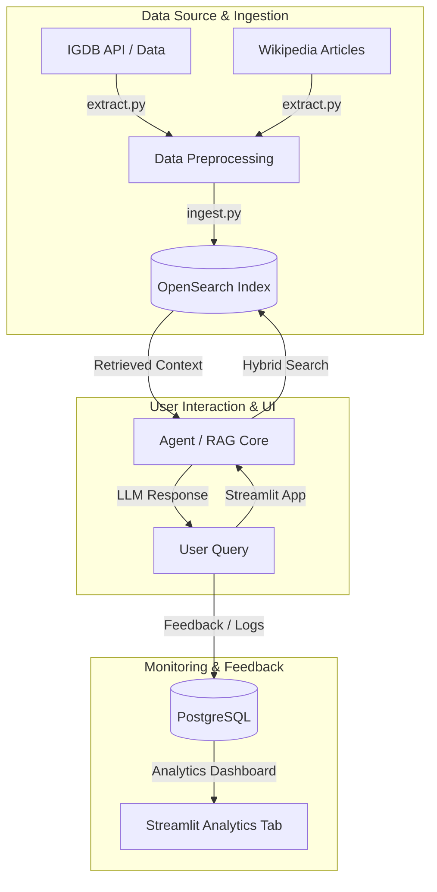

# 🎮 Video Game Knowledge Assistant (SageBot)

An end-to-end RAG (Retrieval-Augmented Generation) AI assistant and agent that unifies fragmented video game data from **IGDB** (structured metadata, release dates, genres, ratings) and **Wikipedia** (deep lore, game history, narrative details) into a single intelligent interface.

Built as a capstone project for the [DataTalks.Club LLM Zoomcamp](https://github.com/DataTalksClub/llm-zoomcamp) cohort.

---

## 📌 Problem Statement

Finding comprehensive video game information is often fragmented:
- **Structured metadata** (release dates, platforms, age ratings, genres) lives on specialized databases like IGDB.
- **Deep narrative lore and development history** are scattered across unstructured sources like Wikipedia.

Standard search engines often fail to synthesize both structured filtering and deep narrative context into direct, natural language answers.

The **Video Game Knowledge Assistant** solves this by aggregating structured metadata and unstructured textual lore into a unified knowledge base, leveraging **Hybrid Search (Lexical + Vector with RRF)** and an **LLM Agent** to answer complex gaming queries with accurate context and source transparency.

---

## 🚀 Quick Start & Installation

### Prerequisites & System Requirements

Depending on your host system's hardware, you can run the assistant in one of two modes:

| Mode | Included Data | Required Docker RAM | OpenSearch Heap (`compose.yaml`) |
| :--- | :--- | :---: | :---: |
| **Full Mode (Default)** | IGDB Metadata + 62,000+ Wikipedia Lore Vectors | **8–10 GB** | `-Xms8g -Xmx8g` |
| **Lightweight Mode** | IGDB Metadata Only (Lower-End Hardware) | **4 GB** | `-Xms4g -Xmx4g` |

#### 🌟 Full Mode Setup (Default)
To support neural vector search across 62,000+ Wikipedia lore chunks, 370,000+ IGDB entries, and on-node ML Commons neural embeddings, OpenSearch requires **8 GB of JVM Heap space** (`-Xms8g -Xmx8g`).

**Setting up Docker Desktop (macOS / Windows):**
1. Open **Docker Desktop**.
2. Go to **Settings** ⚙️ ➔ **Resources** ➔ **Memory**.
3. Set the slider to **at least 8 GB** (10 GB recommended).
4. Click **Apply & restart**.

#### ⚡ Lightweight Mode for Lower-End Hardware (Optional)
If your machine has limited RAM (e.g., 8 GB total system RAM) and cannot allocate 8 GB to Docker:
1. Open `compose.yaml` and update the heap setting under `opensearch`:
   ```yaml
   - "OPENSEARCH_JAVA_OPTS=-Xms4g -Xmx4g"
   ```
2. The assistant will operate using the IGDB metadata index, answering queries on structured game data (genres, platforms, release dates, ratings) with a lightweight memory footprint.

---

### Step-by-Step Installation

#### 1. Clone the Repository
```bash
git clone https://github.com/pedro-cardoso16/video-game-knowledge-assistant.git
cd video-game-knowledge-assistant
```

#### 2. Configure Environment Variables
Execute the setup script:

```bash
chmod +x setup.sh && ./setup.sh
```

Open the generated `.env` and configure your keys:

#### 3. Build and Run Container Services
Run the automation script or start Docker Compose directly:

```bash
docker compose up --build -d && docker compose logs sagebot -f
```

Wait for the initialization process to finish. 

#### 4. Access the Application
Once containers are healthy, open your browser and go to:
👉 **[http://localhost:8501](http://localhost:8501)**

---

## 🏗️ Architecture & Pipeline Flow

The system consists of five main components:
1. **Data Ingestion & Extraction**: Scrapes and structures data from IGDB and Wikipedia.
2. **Knowledge Base**: OpenSearch storing both keyword indices and dense vector embeddings.
3. **Retrieval & RAG Flow**: Hybrid search combining BM25 keyword matching with k-NN vector search using Reciprocal Rank Fusion (RRF).
4. **User Interface**: Streamlit web app providing a chat interface and an analytical dashboard.
5. **Monitoring & Feedback**: PostgreSQL database logging query interactions, LLM latency, token usage, and user feedback (thumbs up/down).



---

## 🧰 Tech Stack

- **LLM / Provider**: Google Gemini (`llm.py`)
- **Embeddings**: SentenceTransformers / HuggingFace embeddings
- **Vector & Keyword Database**: OpenSearch 2.x (Hybrid search + k-NN plugin)
- **Monitoring Database**: PostgreSQL 17
- **UI Framework**: Streamlit
- **Containerization**: Docker & Docker Compose

---

## 📊 Evaluation & Metrics

The project underwent quantitative evaluation for both **Retrieval Performance** and **LLM Output Quality**. Ground truth queries and evaluation notebooks are available in `evaluation.py` and `main.ipynb`.

### 1. Retrieval Evaluation (Hit Rate & MRR)
Evaluated on a ground-truth dataset of queries generated across game titles, lore, and metadata:

| Retrieval Method | Hit Rate @ k | Mean Reciprocal Rank (MRR) |
| :--- | :---: | :---: |
| **Lexical Search (BM25)** | <!-- to be completed by you: e.g. 0.72 --> | <!-- to be completed by you: e.g. 0.65 --> |
| **Semantic Search (Dense Embeddings)** | <!-- to be completed by you: e.g. 0.81 --> | <!-- to be completed by you: e.g. 0.74 --> |
| **Hybrid Search (BM25 + Semantic via RRF)** | **<!-- to be completed by you: e.g. 0.89 -->** | **<!-- to be completed by you: e.g. 0.82 -->** |

*Key Takeaway:* Hybrid search using Reciprocal Rank Fusion yielded the highest retrieval accuracy by effectively combining exact keyword matching (for game titles and character names) with semantic vector search (for lore descriptions).

### 2. LLM Output & Agent Evaluation (LLM-as-a-Judge)
Outputs were evaluated using an LLM-as-a-Judge approach evaluating tool usage and final answer quality:

- **Answer Quality Score**: <!-- to be completed by you: e.g. 92% -->
- **Tool Usage Score**: <!-- to be completed by you: e.g. 95% -->

---

## 🖥️ User Interface & Monitoring

The application is served via a Streamlit interface containing two primary views:

1. **💬 Chat Assistant**:
    - Ask natural language questions about video games, lore, and metadata.
    - Interactive feedback buttons (👍 Thumbs Up / 👎 Thumbs Down) to log output quality.
        
    <div align="center">
    
    <br>
    <em>Figure 1: SageBot Chat Interface Preview</em>
    </div>

2. **📊 Analytics & Feedback Dashboard**:
    - Live operational tracking displaying query history, latency metrics, user feedback distributions, and model performance logs stored in PostgreSQL.

    <div align="center">
    
    <br>
    <em>Figure 2: SageBot Analytics Interface Preview</em>
    </div>

---


## 📂 Project Structure

```text
.
├── media/imgs/            # Screenshots for README
├── app.py                 # Streamlit UI (Chat & Analytics dashboard)
├── compose.yaml           # Multi-container Docker Compose orchestration
├── dockerfile             # Container definition for SageBot application
├── download_model.py      # Pre-downloads embedding models during Docker build
├── extract.py             # Data extraction script for IGDB & Wikipedia
├── ingest.py              # Ingestion pipeline into OpenSearch & Postgres
├── init-db.sh             # Database initialization script for PostgreSQL
├── llm.py                 # LLM invocation, prompting, and tool logic
├── main.ipynb             # Jupyter Notebook containing analysis & evaluation
├── evaluation.py          # Ground truth generation & LLM-as-a-Judge scripts
├── metrics.py             # Metrics computation (Hit Rate, MRR)
├── monitor.py             # Logging user feedback & metrics to Postgres
├── opensearch_utils.py    # OpenSearch index creation & hybrid search logic
├── requirements.txt       # Python dependencies
├── run.sh                 # Startup script
└── setup.sh               # Environment setup helper
```

---

## 🧪 Running Evaluations Offline

If you want to re-run the retrieval and LLM evaluation benchmarks locally:

1. Ensure OpenSearch and Postgres are running.
2. Open the evaluation notebook:
   ```bash
   jupyter notebook main.ipynb
   ```
3. Run all cells to execute ground truth query generation, Hit Rate/MRR evaluation, and LLM-as-a-Judge scoring. Note that you will run a simplified version since the full test takes a very long time.

---

## 🤝 Acknowledgments
Special thanks to the [DataTalks.Club](https://datatalks.club/) team for creating the **LLM Zoomcamp** course and providing the guidelines for this capstone project.
