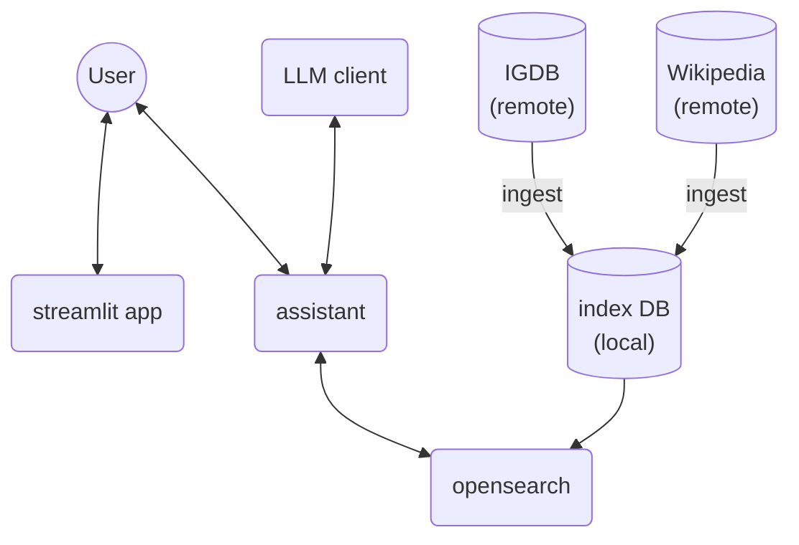
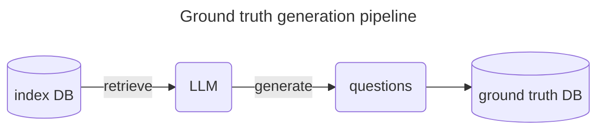
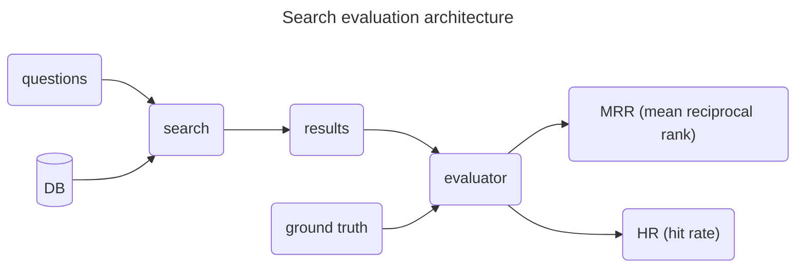
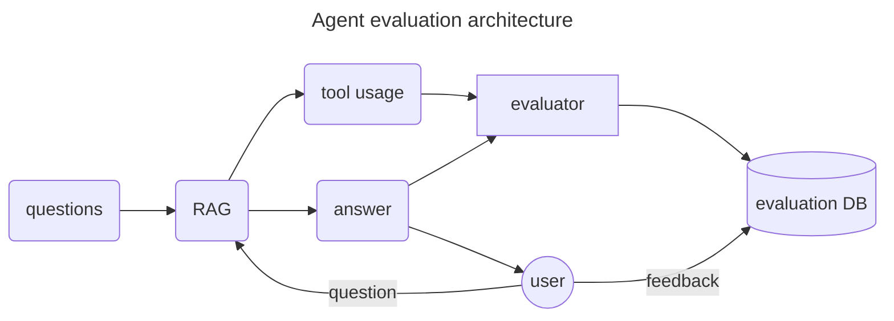
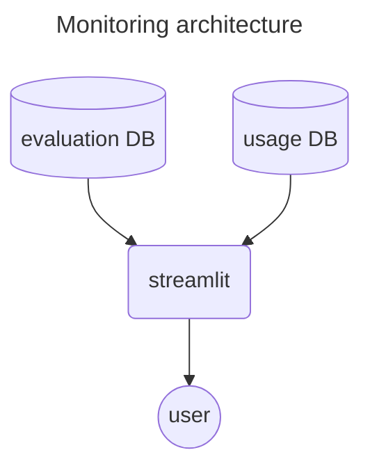

## Acknowledgments
This project was developed as part of the LLM Zoomcamp 2026 cohort leaded by instructor [@alexeygrigorev](https://github.com/alexeygrigorev).
Special thanks to the [DataTalksClub/llm-zoomcamp](https://github.com/DataTalksClub/llm-zoomcamp) community for providing the resources for this project.

# Video game knowledge assistant

Finding comprehensive game data is often fragmented: structured metadata 
(ratings, dates) live in IGDB, while deep lore and history are scattered across 
Wikipedia. Manually synthesizing these sources is tedious.

The **Video game knowledge assistant** is an all-in-one agent that aggregates 
    these sources through a strategic RAG pipeline, offering:
* **Multi-source synthesis**: Merges structured metadata with unstructured lore.
* **Complex Reasoning**: Handles multi-step workflows (e.g., analyzing a game's 
    traits to find similar titles).
* **Optimized Retrieval**: Uses hybrid search (lexical + semantic) to accurately 
    capture both specific titles and broad conceptual themes.

This agent acts as a centralized expert, eliminating "tab-bloat" and providing 
fast, evidence-based answers for any gaming curiosity.


## Getting started

### Docker installation
It's recommended to use a virtual machine with around with at, so as to keep things
isolated from your local machine.

You must have docker engine installed in the system. 
> **Docker engine** installation guide: https://docs.docker.com/engine/install  
<!-- > **Docker desktop** installation guide: https://docs.docker.com/get-started/get-docker/ -->

Once this is done we can begin the setup.

### Run app
In the main project folder execute:
```bash
chmod +x setup.sh && ./setup.sh 
```
This will create a `.env` file. 

In this file, replace the `<>` fields with your keys. You can create a free one using your google account and accessing the site https://aistudio.google.com/api-keys. 

```bash
docker compose up --build -d
```
Wait until the completion is done.

Open in a web browser in the following address:
```bash
https://localhost:8501
```

In the web page you should see

<p align="center">

</p>

That's it! You are free to use the app. Make some questions and see the <u>📊 analytics</u> page
**Don't forget to click on the refresh button**  to update the page view.

> ⚠️ **Warning**:  
> Usually, the only reliable model is `gemini-3.1-flash-lite` if you are using the free tier. Sometimes `gemma-4-31b-it` may work, but more unreliable.

# How it works

## Architecture



RAG
Search evaluation (MRR, RRF)
Response with RAG evaluation (LLM as a judge)
Tool usage evaluation (LLM as a judge)

### Evaluation
One very important aspect of monitoring and pre/post - deployment phases are the 
evaluation. We have offline evaluation (before deployment) and online evaluation 
(post-deployment).

#### Search evaluation
In order to perform the search evaluation we will use the module `evaluation.py`. 
In this module there is a method called `gen_ground_truth` which will use the llm
to generate questions based on random documents of this database. Each question
is tied to single document and this specific document is what we will try to retrieve
using the generated questions as a query




#### Agent evaluation
Once our search tools are optimized, we can proceed to the complete RAG evaluation.
In this step, we use a separate LLM as a judge. 

1. Use the generated questions and query them to the llm.
2. Once the final answer is given the LLM judge rates the final answer and the 
    tool usage each as 'bad' (0.0) 'average' (0.5) or 'good' (1.0)
3. The reviews are saved into a sql database.

##### Users feedbacks
The users can only evaluate the final answer and, for simplicity, they just have two 
options 'bad' (0.0) or 'good' (1.0). These info are also saved in our sql database.




### Data ingestion from IGDB
We use [IGDB](https://www.igdb.com/) information for ingesting metadata and reviews. The data is available remotely and is ingested into the local store (Postgres or OpenSearch) for retrieval.

### Architecture assessment
- Strengths: clear separation of responsibilities (ingest, retrieval, LLM, UI), use of OpenSearch for RAG enables fast vector/keyword search, and Grafana for observability.
- Risks/Improvements: consider explicit vector store and embedding service, caching of LLM responses, access control for remote IGDB, and automated ETL for data freshness. Also clarify whether Postgres or OpenSearch is the primary source of truth and ensure schema/versioning for ingested data.


## Monitoring
For monitoring we will use streamlit, since the data we want to observe is relatively simple.



We can observe the model's performance and usage in the tab <!-- Insert tab name here -->. There we will the following things.
* Users feedback with corresponding questions and answers
* LLM-judge evaluations on tool usage and answer quality
* The token usage (input and output) and price (if you are using a paid model).

On the streamlit app access the *analytics* tab  


<p align="center">

</p>
